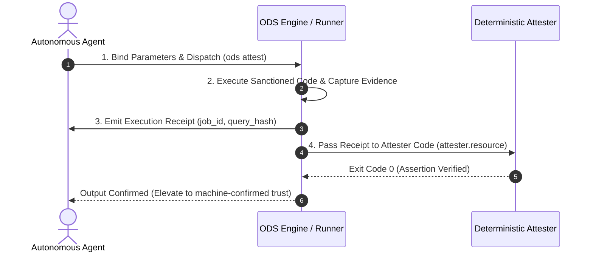

# ODS · Assets & Code Bindings

This document specifies how **Assets**—comprising non-Markdown **resources** and source **code** bindings—are attached to documentation in Open Document Spec (ODS) 2.0, how they interact with AI prompts, and why line numbers are prohibited.

## At a glance

- **What this chapter defines:** `resources` vs `code` vs `load`, simplified string-path code bindings, and the ban on line numbers.
- **Why it exists:** Attachments that look similar (a PNG, a `.ts` file, a JSON schema) must not be treated the same in a prompt.
- **When you need it:** You are binding implementation or cataloging files on disk.
- **When you can skip it:** Documents that do not point at files or source.
- **Learn this first:** [Bind files and code](../guides/04-bind-code-and-files.md)
- **Prerequisite chapters:** [keys.md](keys.md)

---

## 1. Conformance Language

The key words **MUST**, **MUST NOT**, **REQUIRED**, **SHALL**, **SHALL NOT**, **SHOULD**, **SHOULD NOT**, **RECOMMENDED**, **NOT RECOMMENDED**, **MAY**, and **OPTIONAL** in this document are to be interpreted as described in BCP 14, exactly as stated in [README.md §1](README.md#1-conformance-language). That is the canonical statement; do not maintain a second copy here.

---

## 2. What are Assets?

Assets are attachments that connect human-readable prose in Markdown to concrete artifacts on disk:

1. **`resources`**: Non-Markdown data files (PDF reports, architecture diagrams, sample CSVs, OpenAPI specifications) and external URLs.
2. **`code`**: Implementation source files, test fixtures, infrastructure manifests, and CI/CD pipelines — declared as flat string paths.
3. **`load`**: Lightweight text fixtures explicitly injected into AI prompt context.

```text
┌─────────────────────────────────────────────────────────────────────────┐
│ Markdown Document (Source of Truth)                                     │
│ ---                                                                     │
│ # Asset catalog (verified by 'ods lint', not auto-loaded)               │
│ resources:                                                              │
│   - ../diagrams/auth.png                                                │
│                                                                         │
│ # Code bindings (file paths only)                                       │
│ code:                                                                   │
│   - src/auth.ts                                                         │
│   - tests/auth.test.ts                                                  │
│                                                                         │
│ # Prompt payloads (injected during context assembly)                    │
│ load:                                                                   │
│   - ../schemas/auth-payload.json                                        │
│ ---                                                                     │
└─────────────────────────────────────────────────────────────────────────┘
```

---

## 3. When to Use: `resources` vs `code` vs `load`

| Need | Declaration | Phase / Behavior | Why |
| :--- | :--- | :--- | :--- |
| **Architecture diagram / image** | `resources` | Verified by `ods lint`; **NOT** loaded into prompt | Binary image; loading it would waste LLM prompt tokens. |
| **Full PDF specification / report** | `resources` | Verified by `ods lint`; **NOT** loaded into prompt | Large binary file; human reference only. |
| **External design URL (Figma, Miro)** | `resources` (URL string or `{ url }`) | Syntax-checked; **NOT** loaded into prompt | External reference for human readers. |
| **Small JSON schema / mock CSV** | `load` | Verified by `ods lint`; **INJECTED** into prompt | Structured text data the AI agent needs to inspect. |
| **API route / HTTP handler** | `code` | Verified by lint; included in context only when code is requested | Links prose to implementation file. |
| **Unit or integration test** | `code` | Verified by lint; included in context only when code is requested | Links prose to test file. |
| **Database migration script** | `code` | Verified by lint; included in context only when code is requested | Links prose to migration file. |
| **Terraform / Cloud manifest** | `code` | Verified by lint; included in context only when code is requested | Links prose to infrastructure file. |

**Rule of thumb:** If a human needs to know the file exists, catalog it under `resources` or `code`. If an AI agent needs to read the file contents during context assembly, declare it under `load`.

---

## 4. The Binary Asset Token Budget Problem

A common mistake in AI tooling is automatically dumping all document attachments into the LLM context window:

```text
┌─────────────────────────────────────────────────────────────────────────┐
│ DUMPING ALL RESOURCES (Naïve Tooling Failure):                          │
│ • 'resources' contains:                                                 │
│   - network-diagram.png (4.2 MB)                                        │
│   - compliance-audit-2025.pdf (48 MB)                                   │
│ • Result: LLM prompt exceeds 128k token context window instantly!      │
├─────────────────────────────────────────────────────────────────────────┤
│ THE ODS SOLUTION (Surgical Separation):                                 │
│ 1. 'resources' is an Asset Catalog: 'ods lint' verifies files exist     │
│    on disk for human readers, but NEVER passes them to AI prompts       │
│    (unless workspace context.auto_load_resources = true).               │
│ 2. 'load' is the Prompt Scoping Key: Authors explicitly declare         │
│    lightweight JSON schemas, CSVs, or configs for the LLM.              │
│ 3. 'code' is verified for disk existence but included in context        │
│    only when the caller explicitly requests code inclusion.             │
└─────────────────────────────────────────────────────────────────────────┘
```

---

## 5. Non-Markdown Resources (`resources`)

The `resources` list captures non-Markdown attachments without transforming their native format:

```yaml
---
description: Authentication architecture overview.
profile: architecture
status: stable
resources:
  - ../diagrams/network-topology.svg        # Bare string shorthand (local path)
  - https://figma.com/file/auth-flow-v2     # Bare string shorthand (external URL)
  - path: ../reports/q3-audit.pdf           # Mapping with a local path
  - path: ../contracts/billing.openapi.yaml
    title: "Billing OpenAPI Spec"
    description: "API contract verified by CI."
  - url: https://miro.com/board/session-flow
    title: "Session flow whiteboard"
---
```

### 5.1 Entry Shapes (Normative)

An entry in `resources` MUST take one of three shapes:

| Shape | Example | Interpretation |
| :--- | :--- | :--- |
| **Bare string — local path** | `- ../diagrams/flow.png` | Equivalent to `{ path: ../diagrams/flow.png }`. |
| **Bare string — URL** | `- https://figma.com/file/x` | Equivalent to `{ url: https://figma.com/file/x }`. A string is treated as a URL when it carries an `http:` or `https:` scheme. |
| **Mapping** | `{ path?, url?, title?, description? }` | MUST contain exactly one of `path` or `url`. `title` and `description` are optional. |

### 5.2 Normative Rules

1. Each entry MUST resolve to exactly one of `path` (local) or `url` (external). A mapping with both, or with neither, is an error (`ASSET-005`).
2. `path` MUST be a relative path resolved from the document's directory location.
3. A `path` entry MUST exist on disk. A non-existent resource path is dangling and MUST trigger `ASSET-001`.
4. A `url` entry MUST be a syntactically valid absolute URL. Tools MUST NOT perform network liveness checks — external availability is not a conformance property, and a lint run MUST succeed offline.
5. Source code files MUST NOT be declared under `resources`; they MUST be declared under `code`.

---

## 6. Source Code Bindings (`code`)

The `code` array creates a verifiable bridge between architectural prose and software implementation. ODS 2.0 uses **flat string paths only** — no `role`, `symbol`, or `description` fields.

### 6.1 Code Files are NOT ODS Documents

- Source code files (`.ts`, `.rs`, `.py`, `.go`, `.tf`) MUST NOT contain ODS frontmatter.
- Source code files are NOT graph nodes and MUST NOT be indexed as documents.
- The Markdown document remains the single source of truth for all code bindings.

### 6.2 Code Binding Schema

Each entry in `code` MUST be a non-empty string containing a workspace-relative file path:

```yaml
---
description: Refund processing implementation guide.
profile: guide
status: stable
code:
  - apps/api/src/routes/refunds.ts
  - apps/api/src/services/refunds.ts
  - apps/api/tests/refunds.test.ts
  - packages/db/migrations/20260115_add_refunds.sql
  - infra/terraform/refund_queue.tf
  - .github/workflows/deploy-billing.yml
---
```

Semantic meaning (entrypoint vs test vs migration) belongs in the document prose, not in frontmatter role enums. Filename and directory conventions (`tests/`, `migrations/`, `.github/workflows/`) provide sufficient signal for humans and tooling.

### 6.3 Normative Rules

1. Each entry MUST be a string path. Object entries with `path`, `role`, or `symbol` are rejected in ODS 2.0.
2. Paths MUST NOT contain line number suffixes (such as `:L45` or `#L10-L20`). Line-number paths MUST trigger a validation error.
3. Each path MUST exist on disk. A non-existent code path is dangling and MUST trigger `ASSET-002`.
4. Tools MAY optionally resolve symbols within bound files using language-aware AST analysis, but symbol extraction is a tooling feature outside the conformance contract.

---

## 7. Prompt Fixtures (`load`)

The `load` array declares auxiliary non-Markdown text files to inject during AI context assembly:

```yaml
---
description: Refund API contract guide.
profile: api
status: stable
depends:
  - ../auth/sessions.md
load:
  - ../schemas/refund-request.json
  - ../fixtures/refund-success-payload.json
---
```

### 7.1 Normative Rules

1. Each entry MUST be a non-empty string path to a non-Markdown file.
2. Paths MUST be relative to the declaring document's directory, or workspace-relative from the repository root.
3. Each path MUST exist on disk. A non-existent load path is dangling and MUST trigger `ASSET-004`.
4. Markdown document paths MUST NOT appear in `load`. Prerequisites belong in `depends`.
5. `load` files are injected in addition to documents traversed via `depends`, up to the workspace token budget.

See [context.md](context.md) for the full context resolution algorithm.

---

## 8. Why Line Numbers are Strictly Forbidden

```text
┌─────────────────────────────────────────────────────────────────────────┐
│ FRAGILE (Prohibited):                                                   │
│ code: ["src/pricing.ts:L45-L60"]                                        │
│ -> A developer inserts 2 lines of imports at the top of pricing.ts.   │
│    Every line number in the documentation is instantly broken and stale.│
├─────────────────────────────────────────────────────────────────────────┤
│ RESILIENT & REFACTOR-SAFE (Mandated by ODS):                            │
│ code: ["src/pricing.ts"]                                                │
│ -> File paths survive line insertions, formatting changes, and routine  │
│    refactoring without documentation drift.                             │
└─────────────────────────────────────────────────────────────────────────┘
```

- Tools MUST emit a validation error if any `code` entry contains a line number suffix (such as `:L45` or `#L10-L20`).
- Precise symbol-level navigation is a tooling concern; the spec binds documents to files, not to line ranges.

---

## 9. OKF Attested Computation Contracts

In addition to static source code bindings, ODS 2.0 natively supports Google OKF v0.2 **Attested Computations** (`type: Attested Computation`). An attested computation turns a Markdown document into a verifiable executable unit carrying sanctioned queries/code, parameter schemas, execution instructions, and deterministic attester verification.

```yaml
---
type: Attested Computation
title: Monthly Active Customer MRR Calculation
description: Verified BigQuery SQL calculation computing MRR per customer cohort.
tags: [computation, billing, bigquery]
runtime: bigquery
parameters:
  - name: cohort_year
    type: integer
    required: true
    description: Cohort registration calendar year
    default: 2026
executor:
  resource: skills/run-bigquery.md
  receipt:
    - job_id
    - query_hash
    - total_bytes_billed
attester:
  resource: attesters/verify-mrr-receipt.py
sources:
  - id: bq-orders
    resource: datasets/billing/orders.sql
    author: team:data-platform
    usage_count: 8500
verified:
  - by: "human:ahormati"
    at: "2026-08-20T00:00:00Z"
profile: note
status: stable
---

# Monthly Active Customer MRR Calculation

## Computation
```sql
SELECT
  customer_id,
  SUM(amount_usd) AS mrr
FROM `analytics.billing.active_subscriptions`
WHERE EXTRACT(YEAR FROM created_at) = @cohort_year
GROUP BY 1;
```

## Parameters
- `@cohort_year`: 4-digit registration year (e.g. 2026).

## Verification Rationale
Queries production BigQuery replica using signed job credentials with cryptographic hash attestation.
```

### 9.1 Computation Fields Reference

| Key | Type | Requirement | Semantic Meaning |
| :--- | :--- | :---: | :--- |
| **`runtime`** | String | Required | Execution engine (e.g., `bigquery`, `postgres`, `dbt`, `python`, `looker`). |
| **`parameters`** | Array of mappings | Optional | Named, typed input holes (`name`, `type`, `required`, `default`, `description`). |
| **`computation`** | String path | Optional | Workspace-relative path to external SQL/Python script (if not inline in body). |
| **`executor`** | Mapping | Optional | Execution runner instructions (`resource`) and mandatory evidence fields (`receipt`). |
| **`attester`** | Mapping | Optional | Path to deterministic (non-LLM) verification script (`resource`). |

### 9.2 The 4-Step Attestation Lifecycle



1. **Parameter Binding**: The agent binds validated parameter arguments to declared holes.
2. **Sanctioned Execution**: The runner executes the query or script against the target runtime environment.
3. **Receipt Emission**: The execution engine captures verifiable evidence fields declared in `executor.receipt`.
4. **Deterministic Attestation**: The non-LLM attester script inspects the receipt and confirms assertions with exit code 0.

---

## 10. Design Decisions

### Why string-only code bindings instead of roles and symbols?

ODS 1.x defined 10 code roles and optional symbol arrays. In practice, authors either omitted roles or used them inconsistently. ODS 2.0 binds documents to files with flat paths — sufficient for lint verification, IDE navigation, and optional AST tooling. Semantic classification belongs in prose where it can carry context roles cannot express.

### Why separate `resources`, `code`, and `load`?

These three keys answer different questions: "What files exist for human reference?" (`resources`), "What source implements this doc?" (`code`), and "What text should the AI read?" (`load`). Collapsing them would either dump binary PDFs into prompts or hide schemas from agents that need them.

### Why separate attested computations from standard guides?

Attested computations provide mathematical and cryptographic guarantees of reproducibility. Keeping computation parameters, execution runner instructions, and deterministic attester assertions in explicit machine-verifiable frontmatter eliminates hallucinated queries and unauthorized database mutations.

---

## Navigation & Reading Order

| [← Previous Chapter](context.md) | [📑 Specification Index](README.md) | [Next Chapter →](indexes.md) |
| :--- | :---: | ---: |
| **06. Bounded AI Context Scope** | **Open Document Spec (ODS)** | **08. Workspace Config & Progressive Discovery** |
