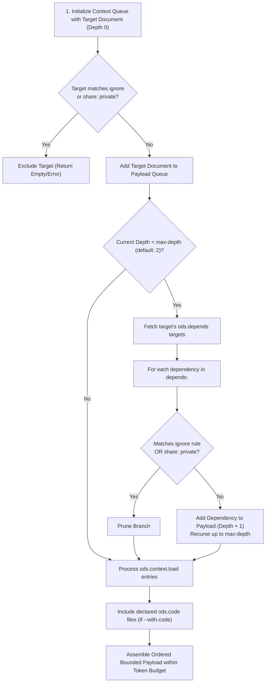

# ODS · Bounded AI Context Scope

This document specifies the **Bounded AI Context** mechanism in Open Document Spec (ODS): deterministic context expansion, lifecycle phase separation, traversal scoping, auxiliary asset loading, conflict analysis, and token budget management.

## At a glance

- **What this chapter defines:** How `ods context` walks `depends`, injects `load`, honors `ignore` / `share`, and optionally includes `code`.
- **Why it exists:** Dumping the repo into a prompt wastes tokens and still misses required prerequisites.
- **When you need it:** You are assembling an agent reading list or implementing the context engine.
- **When you can skip it:** No agent will consume these docs yet.
- **Learn this first:** [Give AI a reading list](../guides/05-ai-reading-list.md)
- **Prerequisite chapters:** [graph.md](graph.md), [keys.md](keys.md)

---

## 1. Conformance Language

The key words **MUST**, **MUST NOT**, **REQUIRED**, **SHALL**, **SHALL NOT**, **SHOULD**, **SHOULD NOT**, **RECOMMENDED**, **NOT RECOMMENDED**, **MAY**, and **OPTIONAL** in this document are to be interpreted as described in BCP 14 ([RFC 2119](https://www.rfc-editor.org/rfc/rfc2119.txt), [RFC 8174](https://www.rfc-editor.org/rfc/rfc8174.txt)) when, and only when, they appear in all capitals.

---

## 2. The 5 Engine Subsystems under `ods:`

Canonical matrix: [keys.md §4](keys.md#4-subsystem-matrix-of-engine-keys). Context resolution treats those **5 engine subsystems** as follows (`code` is opt-in):

```yaml
---
description: "Checkout API Integration and Execution Guide"
tags: [checkout, payments]
ods:
  profile: guide
  status: stable

  # ─────────────────────────────────────────────────────────────────
  # 1. KNOWLEDGE GRAPH (Structural DAG Prerequisites)
  # • Auto-traversed by 'ods context' up to max-depth (default: 2)
  # • Strict DAG: Cycles are forbidden (checked by 'ods lint')
  # ─────────────────────────────────────────────────────────────────
  depends:
    - ../auth/sessions.md
    - ../billing/payment-gateway.md

  # ─────────────────────────────────────────────────────────────────
  # 2. DISCOVERY GRAPH (Human Associative Links)
  # • Skipped by default in 'ods context' (opt-in via --include-related)
  # • Cycles allowed (e.g. Doc A related to Doc B, Doc B related to Doc A)
  # ─────────────────────────────────────────────────────────────────
  related:
    - ../marketing/promotions.md

  # ─────────────────────────────────────────────────────────────────
  # 3. ASSET CATALOG (Disk-level Non-Markdown Files)
  # • Verified for disk existence by 'ods lint'
  # • NOT loaded into LLM prompts by default (protects token limits)
  # ─────────────────────────────────────────────────────────────────
  resources:
    - path: ../diagrams/checkout-flow.pdf      # 15MB binary PDF (do not load into prompt)
    - path: ../schemas/order-payload.json     # Data schema on disk

  # ─────────────────────────────────────────────────────────────────
  # 4. CODE BINDINGS (Implementation & Tests)
  # • Included only when the caller passes --with-code
  # • Not a graph node; path + symbol, never :L45
  # ─────────────────────────────────────────────────────────────────
  code:
    - path: apps/billing/src/refund.ts
      role: implementation
      symbol: processRefund

  # ─────────────────────────────────────────────────────────────────
  # 5. AI PROMPT WINDOW BOUNDS & INCLUSIONS (Surgical Prompt Payload)
  # • Injected directly into the LLM context bundle
  # • Governs recursion bounds and path pruning
  # ─────────────────────────────────────────────────────────────────
  context:
    max-depth: 2                              # Follow 'depends' up to 2 hops deep
    load:
      - ../schemas/order-payload.json         # Surgically inject JSON schema into prompt
      # NOTE: Do NOT list '../auth/sessions.md' here; it is already auto-loaded via 'depends'!
    ignore:
      - archive/                              # Prune historical documents
      - fixtures/                             # Prune noisy test fixtures
---
```

---

## 3. Subsystem Summary Matrix

The following matrix contrasts how the engine treats each key across both phases of the document lifecycle:

| Key | Domain Subsystem | Auto-loaded in `ods context`? | Verified by `ods lint`? | Primary Purpose |
| :--- | :--- | :---: | :---: | :--- |
| **`ods.depends`** | Knowledge Graph | **Yes** (up to `max-depth`) | **Yes** (strict DAG, no cycles, path must exist) | Hard structural prerequisites required to understand this document. |
| **`ods.related`** | Discovery Graph | **No** (opt-in via `--include-related`) | **Yes** (target path must exist) | Soft associative reading for humans and background browsing. |
| **`ods.resources`** | Asset Inventory | **No** (static metadata only) | **Yes** (file must exist on disk) | Disk-level catalog of attachments (PDFs, images, CSVs, OpenAPI). |
| **`ods.context.load`** | AI Prompt Scoping | **Yes** (injected directly) | **Yes** (file must exist on disk) | Explicit non-Markdown data, schemas, or fixtures needed in the LLM prompt. |
| **`ods.context.max-depth`**| Traversal Bound | Governs recursion limit | **Yes** (integer $\ge 0$) | Maximum graph distance to follow `depends` chains (default: 2). |
| **`ods.code`** | Code Bindings | **Optional** (`--with-code`) | **Yes** (path exists, valid role, no `:L45`) | Implementation, tests, and infra the document describes. |
| **`ods.context.ignore`** | Scoping Boundary | Filters expansion queue | **Yes** (list of prefixes) | Path prefixes and directories to strictly prune during context resolution. |

---

## 4. Lifecycle Phase Separation

ODS clearly decouples the **Authoring/Verification Phase** from the **AI Context Resolution Phase**:

```text
┌─────────────────────────────────────────────────────────────────────────┐
│ PHASE 1: Authoring & Verification Phase (Executed by 'ods lint')         │
│ • Validates that files declared in 'resources' exist on disk            │
│ • Validates that 'depends' paths exist and form an acyclic DAG          │
│ • Validates that 'code' bindings exist and contain no line numbers      │
│ • Zero LLM prompt tokens consumed                                       │
└────────────────────────────────────┬────────────────────────────────────┘
                                     │ Passes with Exit Code 0 (Compliant)
                                     ▼
┌─────────────────────────────────────────────────────────────────────────┐
│ PHASE 2: AI Context Resolution Phase (Executed by 'ods context <id>')   │
│ 1. Start at target document (Depth 0)                                   │
│ 2. Auto-traverse 'depends' up to 'max-depth' hops (default: 2)          │
│ 3. Ingest files explicitly listed in 'context.load' (schemas/fixtures)  │
│ 4. Prune branches matching 'context.ignore' or 'share: private'         │
│ 5. Include declared 'ods.code' files (when --with-code is enabled)      │
│ 6. Emit unified bounded prompt payload formatted within --max-tokens    │
└─────────────────────────────────────────────────────────────────────────┘
```

---

## 5. Conflict Analysis & Duplication Rules (FAQ)

### Q1: Do you need to mention `depends` targets in `context.load`?
**No.** `ods context` walks `ods.depends` automatically up to `max-depth`. Declaring dependencies in `depends` is sufficient; duplicating them inside `context.load` is redundant.

```yaml
# RIGHT: Clean separation
ods:
  depends:
    - ../auth/sessions.md         # Auto-walked by context resolution!
  context:
    load:
      - ../schemas/payload.json   # Extra non-document data schema needed by LLM

# WRONG: Redundant duplication
ods:
  depends:
    - ../auth/sessions.md
  context:
    load:
      - ../auth/sessions.md       # REDUNDANT: Already included via 'depends'!
      - ../schemas/payload.json
```

### Q2: Why is a dedicated `context.load` key necessary?
A dedicated `context.load` key solves three fundamental architectural challenges:

#### 1. The Token & Binary Asset Problem (`resources` vs `load`)
`ods.resources` tracks all static assets attached to a document (including 50MB PDFs, high-resolution PNG architecture diagrams, and screen recordings). If `resources` were auto-loaded into an AI context window, binary files would immediately crash LLM context limits or waste tens of thousands of tokens. `context.load` allows authors to surgically select only the lightweight text, JSON schemas, or CSV fixtures the LLM actually needs to read.

#### 2. Knowledge Graph Purity (`depends` vs `load`)
`ods.depends` expresses formal conceptual dependencies between knowledge documents. An AI task often requires auxiliary test data (e.g. a sample mock CSV, a test JSON payload, or an environment template) that is not a conceptual prerequisite document. Overloading `depends` with non-document fixtures would corrupt DAG ordering and topological sorting. `context.load` injects ad-hoc prompt files safely without distorting the knowledge graph.

#### 3. Preventing Context Window Bloat (`related` vs `load`)
`ods.related` links are associative (*"See also..."*). If the engine automatically traversed `related` links, an AI prompt query would trigger an associative explosion across the entire repository. Keeping `related` un-traversed by default, while allowing authors to target specific related documents via `context.load` when strictly necessary, preserves prompt precision.

---

## 6. The Context Resolution Algorithm (Normative)

When `ods context <path-or-id>` is invoked, the engine MUST execute the following deterministic procedure:



### Resolution Steps:
1. **Initialize**: Enqueue the entrypoint document $D_0$ at depth $0$.
2. **Privacy Guard**: If $D_0$ has `ods.share: private` (in an unprivileged session) or matches workspace `ignore`, abort.
3. **Graph Recursion**:
   - For each document at current depth $k < \text{max-depth}$, inspect its `ods.depends` array.
   - For each dependency $D_{k+1}$:
     - If already visited, skip.
     - If matching `context.ignore` or `ods.share: private`, prune the branch.
     - Otherwise, add $D_{k+1}$ to the payload and recurse at depth $k+1$.
4. **Auxiliary Asset Inclusion**:
   - Resolve and load all file paths declared in $D_0$'s `ods.context.load` array.
5. **Code Binding Inclusion**:
   - When code bindings are enabled, resolve all paths declared in `ods.code`.
6. **Topological Formatting**:
   - Format the aggregated payload in topological order (deepest prerequisites first, entrypoint last) within `--max-tokens`.

---

## 7. Concrete End-to-End Walkthrough

### Document Frontmatter (`features/billing/refunds.md`):
```markdown
---
description: Customer credit card refund processing workflow.
tags: [billing, refunds]
ods:
  profile: guide
  status: stable
  share: public

  # Structural prerequisite (Walked automatically up to max-depth = 2)
  depends:
    - ../../auth/sessions.md
    - ../../crypto/tokens.md

  # Soft reference (Skipped in context resolution)
  related:
    - ../../policy/refund-sla.md

  # Asset catalog (Verified on disk; NOT loaded into prompt)
  resources:
    - path: ../../diagrams/refund-flow.pdf

  # AI prompt window configuration
  context:
    max-depth: 2
    load:
      - ../../schemas/refund-request.json   # Injected directly into LLM prompt
    ignore:
      - archive/

  # Implementation code bindings
  code:
    - path: apps/billing/src/refund.ts
      role: entrypoint
      symbol: processRefund
---

# Refund Processing Guide
```

### Resulting Context Output (`ods context features/billing/refunds.md --max-tokens 4000`):
1. `crypto/tokens.md` (Transitive prerequisite at Depth 2)
2. `auth/sessions.md` (Direct prerequisite at Depth 1)
3. `schemas/refund-request.json` (Auxiliary schema via `context.load`)
4. `apps/billing/src/refund.ts` (Entrypoint implementation via `ods.code`)
5. `features/billing/refunds.md` (Primary entrypoint document)

Total Tokens: ~2,850 tokens (comfortably within the 4,000 token budget; zero binary asset overhead).

---

## 8. Design Decisions

### Why not rely solely on vector embeddings / semantic RAG?
Semantic RAG retrieves arbitrary fragments based on keyword similarity, frequently pulling in deprecated code snippets or omitting foundational architectural prerequisites that do not contain the query terms. Graph-driven bounded context is deterministic, reproducible, and complete.

### Why default `max-depth` to 2 hops?
Empirical testing in engineering repositories demonstrates that 2 hops along `depends` captures ~95% of required architectural context while preventing exponential graph expansion from overwhelming LLM prompt token limits.

---

## Navigation & Reading Order

| [← Previous Chapter](graph.md) | [📑 Specification Index](intro.md) | [Next Chapter →](assets.md) |
| :--- | :---: | ---: |
| **05. Document Graph & Identity** | **Open Document Spec (ODS)** | **07. Assets & Code Bindings** |
