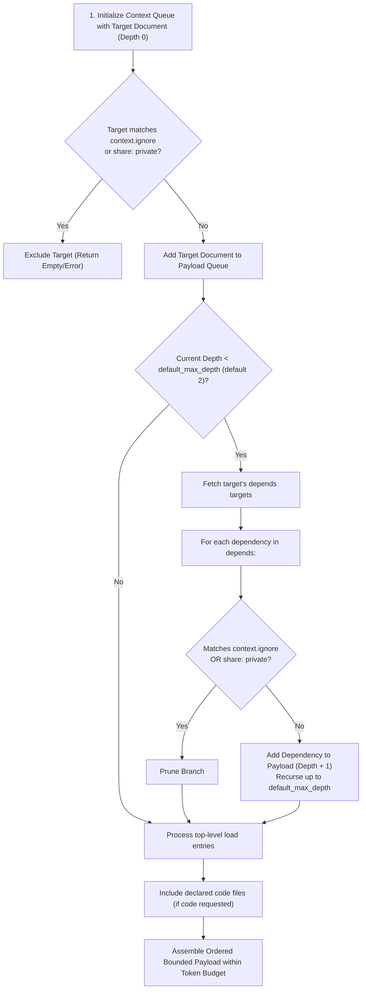

# ODS · Bounded AI Context Scope

This document specifies the **Bounded AI Context** mechanism in Open Document Spec (ODS) **v2.0**: deterministic context expansion, lifecycle phase separation, workspace traversal defaults, auxiliary asset loading via flat `load`, and token budget management.

## At a glance

- **What this chapter defines:** How `ods context` walks `depends`, injects top-level `load`, honors workspace `context.ignore` / `share`, and optionally includes `code`.
- **Why it exists:** Dumping the repo into a prompt wastes tokens and still misses required prerequisites.
- **When you need it:** You are assembling an agent reading list or implementing the context engine.
- **When you can skip it:** No agent will consume these docs yet.
- **Learn this first:** [Give AI a reading list](../guides/05-ai-reading-list.md)
- **Prerequisite chapters:** [graph.md](graph.md), [keys.md](keys.md)

---

## 1. Conformance Language

The key words **MUST**, **MUST NOT**, **REQUIRED**, **SHALL**, **SHALL NOT**, **SHOULD**, **SHOULD NOT**, **RECOMMENDED**, **NOT RECOMMENDED**, **MAY**, and **OPTIONAL** in this document are to be interpreted as described in BCP 14, exactly as stated in [README.md §1](README.md#1-conformance-language). That is the canonical statement; do not maintain a second copy here.

---

## 2. The Four Subsystems Seen by Context Resolution

ODS 2.0 uses flat frontmatter. Context resolution treats four path-bearing subsystems as follows (`code` is opt-in):

```yaml
---
description: Checkout API integration and execution guide.
tags: [checkout, payments]
profile: guide
status: stable
share: public

# 1. KNOWLEDGE GRAPH — auto-traversed up to workspace default_max_depth (default 2)
depends:
  - ../auth/sessions.md
  - ../billing/payment-gateway.md

# 2. DISCOVERY GRAPH — titles/descriptions only; bodies never auto-loaded
related:
  - ../marketing/promotions.md

# 3. ASSET CATALOG — verified on disk; never loaded into prompts
resources:
  - ../diagrams/checkout-flow.pdf
  - path: ../schemas/order-payload.json

# 4. CODE BINDINGS — opt-in; whole files when requested (string paths only)
code:
  - apps/billing/src/refund.ts

# 5. PROMPT FIXTURES — injected directly into the LLM context bundle
load:
  - ../schemas/order-payload.json
---
# Checkout Integration Guide
```

Traversal depth and ignore prefixes are **workspace defaults** in `ods.toml`, not per-document frontmatter keys.

---

## 3. Workspace Context Defaults (`ods.toml`)

In ODS 2.0, bounded traversal is configured once at the workspace boundary:

```toml
spec = "2.0"

# Directory prefixes excluded from document scanning and linting
ignore = ["target", "node_modules", "dist"]

# Bounded context resolution defaults
[context]
default_max_depth = 2          # Hops along depends (range 0–10; default 2)
auto_load_resources = false    # When false, resources stay catalog-only
ignore = ["archive/", "fixtures/"]   # Pruned during context traversal
```

| Key | Type | Default | Meaning |
| :--- | :--- | :--- | :--- |
| `context.default_max_depth` | integer `0`–`10` | `2` | Maximum hops to follow along `depends` during context assembly. `0` loads the entrypoint document alone. |
| `context.auto_load_resources` | boolean | `false` | When `true`, text/JSON resources MAY be auto-injected. When `false` (default), use `load` for surgical injection. |
| `context.ignore` | list of strings | `[]` | Path prefixes pruned during context traversal (in addition to workspace-level `ignore`). |

There is **no** `max-depth`, `context.load`, `context.ignore`, or `trust-min` in document frontmatter. Per-document overrides were removed to keep the flat model predictable.

Canonical workspace key reference: [indexes.md §3](indexes.md#3-workspace-configuration-key-reference).

---

## 4. Subsystem Summary Matrix

Canonical auto-load and lint behavior per key: [keys.md §4](keys.md#4-engine-key-summary-matrix).

What matters for context resolution specifically:

- **`depends`** is the only edge type traversed for **document bodies**, and only up to `context.default_max_depth`.
- **`related`** contributes **titles and descriptions only** — a one-line "Related Context Index". Bodies are never pulled in automatically.
- **`resources`** contributes **nothing** to the payload unless `context.auto_load_resources = true` and the resource is text/JSON. Default behavior is catalog-only.
- **`load`** injects arbitrary file contents declared on the entrypoint document (and, when recursing, on each loaded document's own `load` list).
- **`code`** is opt-in and contributes whole source files (string paths only; no symbol slicing in 2.0).

---

## 5. Lifecycle Phase Separation

ODS clearly decouples the **Authoring/Verification Phase** from the **AI Context Resolution Phase**:

```text
┌─────────────────────────────────────────────────────────────────────────┐
│ PHASE 1: Authoring & Verification Phase (Executed by 'ods lint')         │
│ • Validates that files declared in 'resources' exist on disk            │
│ • Validates that 'depends' and 'related' paths exist and form a DAG     │
│ • Validates that 'code' and 'load' paths exist; no line numbers in code │
│ • Zero LLM prompt tokens consumed                                       │
└────────────────────────────────────┬────────────────────────────────────┘
                                     │ Passes with Exit Code 0 (Compliant)
                                     ▼
┌─────────────────────────────────────────────────────────────────────────┐
│ PHASE 2: AI Context Resolution Phase (Executed by 'ods context <id>')   │
│ 1. Start at target document (Depth 0)                                   │
│ 2. Auto-traverse 'depends' up to context.default_max_depth (default 2)  │
│ 3. Ingest files listed in top-level 'load'                              │
│ 4. Prune branches matching context.ignore or share: private             │
│ 5. Include declared 'code' files (only when code is requested)          │
│ 6. Emit unified bounded prompt payload within the caller's token budget │
└─────────────────────────────────────────────────────────────────────────┘
```

---

## 6. Conflict Analysis & Duplication Rules (FAQ)

### Q1: Do you need to mention `depends` targets in `load`?

**No.** `ods context` walks `depends` automatically up to `default_max_depth`. Declaring dependencies in `depends` is sufficient; duplicating them inside `load` is redundant.

```yaml
# RIGHT: Clean separation
depends:
  - ../auth/sessions.md
load:
  - ../schemas/payload.json

# WRONG: Redundant duplication
depends:
  - ../auth/sessions.md
load:
  - ../auth/sessions.md
  - ../schemas/payload.json
```

### Q2: Why is a dedicated `load` key necessary?

A dedicated top-level `load` key solves three architectural challenges:

#### 1. The Token & Binary Asset Problem (`resources` vs `load`)

`resources` tracks all static assets (50MB PDFs, PNG diagrams, screen recordings). Auto-loading them would crash LLM context limits. `load` lets authors surgically select lightweight text, JSON schemas, or CSV fixtures the agent actually needs.

#### 2. Knowledge Graph Purity (`depends` vs `load`)

`depends` expresses formal conceptual dependencies between **Markdown documents**. An AI task often requires auxiliary test data (mock CSV, JSON payload, environment template) that is not a conceptual prerequisite. Overloading `depends` with non-document fixtures would corrupt DAG ordering. `load` injects ad-hoc prompt files without distorting the knowledge graph.

#### 3. Preventing Context Window Bloat (`related` vs `load`)

`related` links are associative (*"See also..."*). Auto-traversing `related` would trigger an associative explosion across the repository. Keeping `related` un-traversed by default preserves prompt precision.

### Q3: Where do I set traversal depth?

In root `ods.toml` under `[context].default_max_depth`. ODS 2.0 does **not** support per-document `max-depth` overrides in frontmatter.

```toml
[context]
default_max_depth = 3
```

---

## 7. The Context Resolution Algorithm (Normative)

When `ods context <path-or-id>` is invoked, the engine MUST execute the following deterministic procedure:



### Resolution Steps (ODS 2.0)

1. **Initialize**: Enqueue the entrypoint document $D_0$ at depth $0$. Read `context.default_max_depth` from `ods.toml` (default $2$).
2. **Privacy & Staleness Guard**:
   - If $D_0$ has `share: private` (in an unprivileged session) or matches workspace `context.ignore`, abort.
   - If $D_0$ has `stale_after` and $\text{now} \ge \text{stale_after}$, flag as stale or refuse if `--strict-freshness` is enabled.
3. **Adaptive Token-Budget Allocation**:
   - **Tier 1 (50% Budget — Primary Focus)**: Target document $D_0$ body + H2 headings.
   - **Tier 2 (35% Budget — Prerequisites)**: Recurse along `depends` up to `default_max_depth`. Frontmatter is stripped to minimize token overhead.
   - **Tier 3 (10% Budget — Fixtures)**: Load `load` files from the entrypoint and each traversed document.
   - **Tier 4 (5% Budget — Discovery Index)**: Scan `related` links and append a one-line **"Related Context Index"** with each target's title and `description` — never its body.
4. **Code Binding Inclusion**:
   - When the caller requests code, include the full files listed in `code` (string paths). Line numbers are never used.
5. **Final Assembly & Topological Formatting**:
   - Format the aggregated payload in topological order (deepest prerequisites first, entrypoint last) within the caller's token budget.
   - Emit a deterministic, ordered, token-bounded context payload with provenance footnotes.

---

## 8. Concrete End-to-End Walkthrough

### Document Frontmatter (`features/billing/refunds.md`)

```markdown
---
description: Customer credit card refund processing workflow.
tags: [billing, refunds]
profile: guide
status: stable
share: public

depends:
  - ../../auth/sessions.md
  - ../../crypto/tokens.md

related:
  - ../../policy/refund-sla.md

resources:
  - ../../diagrams/refund-flow.pdf

load:
  - ../../schemas/refund-request.json

code:
  - apps/billing/src/refund.ts
---

# Refund Processing Guide
```

### Workspace Config (`ods.toml`)

```toml
spec = "2.0"

[context]
default_max_depth = 2
ignore = ["archive/"]
```

### Resulting Context Output (entrypoint `features/billing/refunds.md`, budget 4,000 tokens)

1. `crypto/tokens.md` (Transitive prerequisite at Depth 2)
2. `auth/sessions.md` (Direct prerequisite at Depth 1)
3. `schemas/refund-request.json` (Auxiliary schema via `load`)
4. `apps/billing/src/refund.ts` (Implementation file via `code`, when requested)
5. `features/billing/refunds.md` (Primary entrypoint document)
6. Related index line for `policy/refund-sla.md` (title + description only)

Total Tokens: ~2,850 tokens (within the 4,000 token budget; zero binary asset overhead).

---

## 9. Design Decisions

### Why not rely solely on vector embeddings / semantic RAG?

Semantic RAG retrieves arbitrary fragments based on keyword similarity, frequently pulling in deprecated snippets or omitting foundational prerequisites. Graph-driven bounded context is deterministic, reproducible, and complete.

### Why default `default_max_depth` to 2 hops?

Empirical testing in engineering repositories demonstrates that 2 hops along `depends` captures ~95% of required architectural context while preventing exponential graph expansion from overwhelming LLM prompt token limits.

### Why move `max-depth` to `ods.toml`?

Per-document depth overrides made context payloads hard to reason about in CI and agent pipelines. A single workspace default keeps traversal predictable; authors who need deeper context for a one-off query pass `--max-depth` as a runtime flag instead.

---

## Navigation & Reading Order

| [← Previous Chapter](graph.md) | [📑 Specification Index](README.md) | [Next Chapter →](assets.md) |
| :--- | :---: | ---: |
| **05. Document Graph & Identity** | **Open Document Spec (ODS)** | **07. Assets & Code Bindings** |
