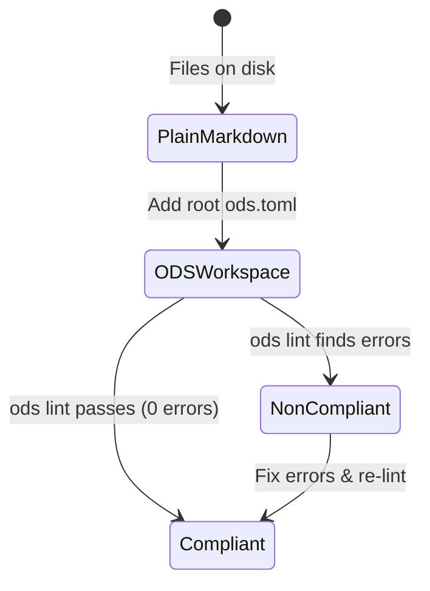
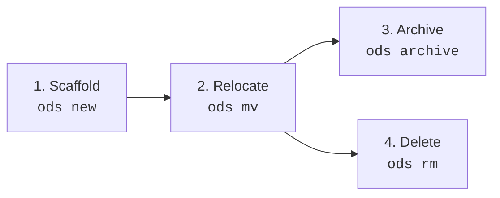

# ODS · Core Format Model & Conformance

This document defines the normative format model, compliance requirements, and lifecycle operations for Open Document Spec (**ODS**) version 2.0.

## At a glance

- **What this chapter defines:** The document file model (optional YAML + Markdown body), binary compliance, lifecycle operations, and profile inference.
- **Why it exists:** Every other chapter assumes one format, one pass/fail gate, and one home for the title.
- **When you need it:** You are implementing a parser, writing CI, or deciding where the title lives.
- **When you can skip it:** You only want to write a first document — use [Your first document](../guides/01-first-document.md).
- **Learn this first:** [Why ODS exists](../guides/00-why-ods.md) → [Your first document](../guides/01-first-document.md)
- **Prerequisite chapters:** [README.md](README.md) (map).

---

## 1. Conformance Language

The key words **MUST**, **MUST NOT**, **REQUIRED**, **SHALL**, **SHALL NOT**, **SHOULD**, **SHOULD NOT**, **RECOMMENDED**, **NOT RECOMMENDED**, **MAY**, and **OPTIONAL** in this document are to be interpreted as described in BCP 14, exactly as stated in [README.md §1](README.md#1-conformance-language). That is the canonical statement; do not maintain a second copy here.

---

## 2. Design Principles (Priority Order)

1. **Human First**: Documents MUST remain plain UTF-8 text, readable and editable in any standard text editor across all operating systems.
2. **Zero-Friction Adoption**: Standard Markdown without frontmatter is valid. Adopting ODS means enriching documents with metadata; it MUST NOT require rewriting or migrating existing documentation into a proprietary schema.
3. **Token Efficient (DRY / SSOT)**: Every metadata fact MUST have exactly one canonical home. Metadata MUST NOT duplicate prose, and body text MUST NOT re-declare machine attributes.
4. **Graph Native**: Relationships between documents are explicit frontmatter edges forming a verifiable Directed Acyclic Graph (DAG), rather than inferred through ambiguous prose links.
5. **Trust from Validation**: The specification MUST NOT require rules that cannot be automatically verified by tooling and CI linters.

---

## 3. Format Model

An ODS Document is a Markdown file (`.md`) containing optional YAML frontmatter. ODS 2.0 uses **flat top-level keys** — there is no `ods:` wrapper block.

```text
┌─────────────────────────────────────────────────────────────────────────┐
│ YAML Frontmatter (Optional)                                             │
│ ---                                                                     │
│ # Universal metadata (visible to all YAML/OKF tools)                    │
│ description: Universal summary for previews and search                    │
│ tags: [auth, security]                                                  │
│ owner: team:security                                                    │
│ author: Alice Smith                                                     │
│ created_at: 2026-08-26                                                  │
│ type: BigQuery Table          # OKF v0.2 concept type                   │
│ sources: [{ id: bq-src, resource: datasets/auth.sql }]                  │
│ verified: [{ by: "human:ahormati", at: "2026-08-20T00:00:00Z" }]        │
│                                                                         │
│ # ODS engine keys (flat, top-level)                                     │
│ profile: guide                                                          │
│ status: stable                                                          │
│ depends: [../crypto/tokens.md]                                          │
│ related: [../policy/data-retention.md]                                  │
│ code: [src/auth/server.ts, tests/tokens.test.ts]                        │
│ resources: [../diagrams/session-flow.png]                               │
│ load: [../schemas/session.schema.json]                                  │
│ ---                                                                     │
├─────────────────────────────────────────────────────────────────────────┤
│ Body Prose (Markdown)                                                   │
│ # Document Title (Primary title definition)                             │
│                                                                         │
│ ## Overview                                                             │
│ Human-readable explanation, decisions, and usage.                       │
└─────────────────────────────────────────────────────────────────────────┘
```

### 3.0 Minimal Conformant Document

ODS adoption is **additive**. Conformance is defined by what a document does not get wrong, not by what it declares.

| Level | Requirement | Status |
| :--- | :--- | :--- |
| **Absolute minimum** | A UTF-8 Markdown file inside the workspace. Frontmatter MAY be absent entirely. | **Conformant** |
| **Recommended floor** | `description` + `profile` + `status`. | **Conformant + useful** |
| **Everything else** | `depends`, `related`, `code`, `resources`, `load`, OKF attestations. | **Progressive enhancement** |

- A document with no frontmatter MUST NOT be reported as an error. Tools MAY report an informational hint suggesting `description` and `profile`.
- A document that omits `profile` is treated as `profile: note`, whose section contract is empty; missing sections are advisory only.
- A document that omits `status` is treated as `status: draft`.
- No key is required for conformance. Errors arise only from keys that are **present and wrong** (invalid enum, dangling path, cyclic `depends`, forbidden `ods:` block).

```markdown
---
description: "How JWT session tokens are signed, verified, and revoked."
profile: guide
status: stable
---

# User Authentication Guide

## Overview
...
```

This document is complete. Authors SHOULD NOT add keys speculatively; each additional key exists to solve a problem stated in its own chapter.

Adoption stages, and the guide that teaches each, are laid out in [Learn ODS](../guides/README.md).

---

### 3.1 Frontmatter

- Frontmatter MUST be a single YAML document delimited by `---` on the first line of the file and closed by `---` on its own line.
- Frontmatter is **optional**. All fields within frontmatter are **optional**.
- Frontmatter contains machine-readable metadata intended for developer tooling, search indexers, and AI agent runtimes.
- The document's primary title MUST be defined as the first `# H1` heading in the body.
- If `title:` or `name:` is present in frontmatter, it MUST match that `# H1` text exactly. A mismatch is reported as `TITLE-001`. OKF documents carrying `type:` are exempt.
- The `ods:` key MUST NOT appear in ODS 2.0 frontmatter. Its presence is a schema error.
- Parsers and tools MUST preserve unknown frontmatter keys to guarantee zero-friction interoperability with Static Site Generators (SSGs) and external tools.

### 3.2 Native Google OKF v0.2 Superset Interoperability

ODS 2.0 operates as a strict superset of Google's Open Knowledge Format (OKF v0.2):

- Any valid OKF bundle (`index.md`, `log.md`, `references/`, `computations/`) is automatically a compliant ODS workspace when `spec = "2.0"` is declared and documents use flat frontmatter.
- Top-level OKF keys (`type`, `title`, `description`, `resource`, `tags`, `sources`, `usage_window`, `generated`, `verified`, `status`, `stale_after`, `runtime`, `parameters`, `computation`, `executor`, `attester`, `okf_version`) are first-class native primitives.

### 3.3 Body Prose

- The body contains human-readable Markdown prose (purpose, architectural rationale, workflows, diagrams, and code snippets).
- The body MUST NOT re-declare metadata already declared in frontmatter (such as `owner`, `status`, or edge lists).
- In standard ODS documents, the document's primary title MUST be defined as the first `# H1` heading in the body.

### 3.4 Machine-Readable JSON Schemas

The normative data structures of ODS 2.0 are formally defined using **JSON Schema Draft 2020-12**. Three schemas are normative:

- **Frontmatter Schema (v2.0.0)**: [`schemas/2.0.0/document.schema.json`](../schemas/2.0.0/document.schema.json) (`https://raw.githubusercontent.com/open-doc-spec/ods-spec/main/schemas/2.0.0/document.schema.json`)
- **Workspace Config Schema (v2.0.0)**: [`schemas/2.0.0/config.schema.json`](../schemas/2.0.0/config.schema.json) (`https://raw.githubusercontent.com/open-doc-spec/ods-spec/main/schemas/2.0.0/config.schema.json`)
- **Custom Profile Schema (v2.0.0)**: [`schemas/2.0.0/profile.schema.json`](../schemas/2.0.0/profile.schema.json) (`https://raw.githubusercontent.com/open-doc-spec/ods-spec/main/schemas/2.0.0/profile.schema.json)

Tooling, linters, and language servers SHOULD use the normative schemas for Stage 1 structural validation and editor autocompletion.

---

## 4. Compliance Model (Binary)

ODS evaluates workspace compliance as a **binary state**. There is no Level 0–3 compliance ladder.



| State | Definition | Validation Criteria |
| :--- | :--- | :--- |
| **Plain Markdown** | Markdown files without a workspace root marker. | Valid Markdown; not managed by ODS. |
| **ODS Workspace** | Directory tree containing a root `ods.toml` marker with `spec = "2.0"`. | Tooling discovers documents and enforces ODS 2.0 rules. |
| **Compliant** | An ODS workspace where `ods lint` passes with **zero errors** (exit code `0`). | Graph edges resolve, IDs are unique, no cycles exist, paths exist, schemas conform. |
| **Non-Compliant** | An ODS workspace containing one or more lint **errors** (exit code `1`). | Tooling reports directive diagnostics and remediation steps. |

---

## 5. Atomic Lifecycle Operations

Conformant ODS tools MUST implement or support four atomic lifecycle operations to maintain graph integrity during repository evolution:



### 1. Scaffold (`ods new <path>`)

- Creates a new Markdown document at the specified path with valid frontmatter (`profile`, `status: draft`, optional `description`).
- Derives the document ID automatically from `<path>`.
- Injects standard section heading placeholders corresponding to the chosen profile.

### 2. Relocate (`ods mv <from> <to>`)

- Moves or renames the file from `<from>` to `<to>`.
- Automatically rewrites all inbound references across the workspace, including:
  - `depends` and `related` in other documents.
  - `load` references.
  - Inline Markdown links written in standard `[text](target)` form, where `target` is a workspace-relative path to the moved document.
  - Code bindings and relative resource paths.

### 3. Archive (`ods archive <path>`)

- Updates `status` to `archived`.
- Preserves all inbound and outbound graph edges so historical context remains intact.
- Optionally moves the document to an `archive/` folder if configured by the workspace.

### 4. Delete (`ods rm <path>`)

- Removes the document file from the filesystem.
- Scans the entire workspace and automatically scrubs the deleted document's path/ID from all inbound `depends`, `related`, and `load` arrays to prevent dangling references.

---

## 6. Smart Profile Inference Heuristics

When adopting untyped Markdown documents into an ODS workspace, tools SHOULD scan existing `##` and `###` headings to infer the most appropriate `profile`. The heading sets below are *inference hints*; the normative section contract for each profile lives in [profiles.md §3](profiles.md#3-standard-profiles-catalog).

| Heading Keywords Found in Document | Inferred Profile | Rationale |
| :--- | :--- | :--- |
| Goal, Scope, Requirements, Acceptance Criteria, Risks | `feature` | Product specification / PRD structure |
| Overview, Prerequisites, Steps, Troubleshooting | `guide` | Step-by-step procedural tutorial |
| Context, Decision, Alternatives, Consequences | `decision` | Architecture Decision Record (ADR) |
| Purpose, Prerequisites, Steps, Validation, Rollback | `sop` | Operations runbook / standard procedure |
| Overview, Request, Response, Errors, Examples, Endpoint | `api` | API endpoint / interface reference |
| Overview, Components, Data Flow, Trade-offs | `architecture` | System architecture overview |
| Purpose, Scope, Rules, Exceptions | `policy` | Organizational policy / governance |
| Attendees, Agenda, Decisions, Action Items | `meeting` | Meeting notes and outcomes |
| Items, Verification, Checklist, Gates | `checklist` | Verifiable deployment/release checklist |
| Goal, Task, Constraints, Success Criteria, Failure Modes, Output | `agent` | Autonomous agent instruction / prompt contract |
| Purpose, Capability, Activation, Workflow, Tools, Eval, Validation | `skill` | Reusable skill package / capability definition |
| *(None of the above / mixed headings)* | `note` | Default free-form document shape |

---

## 7. Design Decisions

### Why flat frontmatter instead of an `ods:` wrapper?

ODS 2.0 removes the indirection of nesting engine keys under `ods:`. Flat keys are easier to read, simpler to schema-validate, and align with how authors already write universal metadata (`description`, `tags`). The wrapper added ceremony without enabling features that flat keys cannot express.

### Why separate Frontmatter and Body Prose?

Frontmatter is optimized for deterministic machine indexing, CI validation, and graph traversal. Body prose is optimized for human reading and rich explanations. Mixing machine metadata (such as graph edges and code bindings) inside prose leads to fragile regular expressions and parse errors.

### Why require title/body consistency when `title:` is present?

When `title:` exists in frontmatter but diverges from the `# H1` heading, search indexes, link previews, and agent summaries disagree about the document name. `TITLE-001` enforces a single source of truth while still allowing OKF bundles to carry native `title:` keys.

### Why binary compliance instead of compliance levels?

Compliance levels (e.g. Level 0 through 3) created confusion for developers regarding whether a doc was "good enough" for CI. Binary compliance provides an unambiguous contract: `ods lint` either passes (exit 0) or fails (exit 1).

---

## Navigation & Reading Order

| [← Previous Chapter](README.md) | [📑 Specification Index](README.md) | [Next Chapter →](keys.md) |
| :--- | :---: | ---: |
| **01. Introduction & Overview** | **Open Document Spec (ODS)** | **03. Frontmatter Key Dictionary** |
