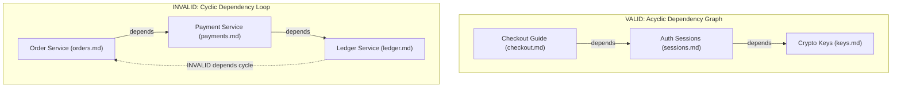

# ODS · Document Graph & Identity

This document specifies the **ODS Document Graph**: document identity, path-derived IDs, single source of truth rules, graph edge types (`depends` / `related`), DAG cycle prevention, and the principle of **Knowledge Graph Purity**.

## At a glance

- **What this chapter defines:** Path-derived IDs, `depends` vs `related`, acyclicity, and document-only purity.
- **Why it exists:** Tools can only lint and walk edges that are explicit and well-typed.
- **When you need it:** You are linking documents, debugging a cycle, or implementing graph validation.
- **When you can skip it:** Isolated documents with no prerequisites — you do not need a graph yet.
- **Learn this first:** [Link documents](../guides/03-link-documents.md)
- **Prerequisite chapters:** [keys.md](keys.md)

---

## 1. Conformance Language

The key words **MUST**, **MUST NOT**, **REQUIRED**, **SHALL**, **SHALL NOT**, **SHOULD**, **SHOULD NOT**, **RECOMMENDED**, **NOT RECOMMENDED**, **MAY**, and **OPTIONAL** in this document are to be interpreted as described in BCP 14 ([RFC 2119](https://www.rfc-editor.org/rfc/rfc2119.txt), [RFC 8174](https://www.rfc-editor.org/rfc/rfc8174.txt)) when, and only when, they appear in all capitals.

---

## 2. Document Identity: IDs are Paths

Every ODS document has a unique identifier within its workspace.

### 2.1 Default: Path-Derived ID
By default, a document's ID **is its workspace-relative file path without the `.md` extension**, normalized using forward slash (`/`) separators:

```text
File Path on Disk                  Workspace Document ID
docs/guides/setup.md           →   docs/guides/setup
features/billing/checkout.md   →   features/billing/checkout
README.md                      →   README
```

- **Deterministic & Zero-Config**: Authors do not need to invent arbitrary UUIDs, database slugs, or hash strings.
- **Normalization**: IDs are case-insensitive. Tools MUST normalize paths to lowercase `a-z`, `0-9`, `-`, `_`, and `/`.
- **Cross-Platform Separators**: Path separators MUST always be normalized to `/` across macOS, Linux, and Windows.

### 2.2 Explicit Override: `ods.id`
An explicit `ods.id` field MAY be set in frontmatter to override the path-derived ID:

```yaml
---
ods:
  # Overrides default path-derived ID for rename stability
  id: architecture/auth-v2
  profile: architecture
  status: stable
---
```

- **When to Use**: Use `ods.id` primarily for **rename stability** when reorganizing heavily referenced legacy documents without immediately cascading link rewrites.
- **Uniqueness**: All document IDs (path-derived or explicit) MUST be unique across the workspace. Duplicate IDs MUST trigger a validation error.

---

## 3. The Two Graph Edge Types

ODS standardizes exactly **two** explicit relationship types under the `ods:` mapping:

```text
       ┌──────────────────────────────┐
       │   Current Document (Node)    │
       └──────────────┬───────────────┘
                      │
        ┌─────────────┴─────────────┐
        │                           │
  [ ods.depends ]             [ ods.related ]
  Hard Prerequisite           Soft Reference
  Directional DAG             Associative Link
        │                           │
        ▼                           ▼
┌───────────────┐           ┌───────────────┐
│ Target Doc A  │           │ Target Doc B  │
└───────────────┘           └───────────────┘
```

| Edge Type | Subsystem Role | AI Context Expansion | Cyclic Loops Allowed? |
| :--- | :--- | :--- | :---: |
| **`ods.depends`** | **Knowledge Graph** | Auto-traversed transitively up to `max-depth` (default: 2 hops). | **NO (Strict DAG)** |
| **`ods.related`** | **Discovery Graph** | Skipped by default in AI context (opt-in via `--include-related`). | **YES** |

---

## 4. Knowledge Graph Purity (Normative)

A critical principle of ODS is **Knowledge Graph Purity**:

```text
┌─────────────────────────────────────────────────────────────────────────┐
│ PRINCIPLE: KNOWLEDGE GRAPH PURITY                                       │
│ • 'ods.depends' expresses conceptual prerequisites between DOCUMENTS.   │
│ • Non-document fixtures (JSON schemas, sample CSVs, mock payloads) MUST │
│   NOT be placed in 'depends'.                                           │
│ • Why? Non-document files cannot participate in topological sort DAG    │
│   validation. Auxiliary test/prompt data belongs in 'context.load'.     │
└─────────────────────────────────────────────────────────────────────────┘
```

### Commented Comparison:
```yaml
# VALID: Pure Knowledge Graph dependencies + surgical prompt scoping
ods:
  # 1. Conceptual document dependencies (Participate in DAG topological sort)
  depends:
    - ../auth/sessions.md
    - ../crypto/jwt-spec.md

  # 2. Auxiliary prompt payload (Non-document fixtures for AI agent)
  context:
    load:
      - ../schemas/auth-payload.json

# INVALID: Corrupting the Knowledge Graph with non-document fixtures
ods:
  depends:
    - ../auth/sessions.md
    - ../schemas/auth-payload.json    # INVALID: JSON schema is not an ODS document!
```

---

## 5. DAG Validation & Cycle Prevention

The dependency graph formed by `ods.depends` edges MUST be a **Directed Acyclic Graph (DAG)**.



### 5.1 Cycle Detection Algorithm
1. Tooling performs a topological sort or Depth-First Search (DFS) traversal of all `ods.depends` edges across the workspace.
2. If any node path encounters a back-edge to an ancestor node in the active traversal stack, a cycle error is reported (`GRAPH-004`).
3. If two documents are mutually interdependent, one relationship MUST be changed to `ods.related` or refactored into a shared prerequisite document.

---

## 6. Single Source of Truth & Dynamic Backlinks

1. **Title Lives Once**: The document title is the first `# H1` in the body. Frontmatter MUST NOT contain `title:`. Rationale: [core.md](core.md#why-prohibit-title-in-frontmatter).
2. **Relationships Live in Frontmatter**: Machine-readable dependencies live exclusively in `ods.depends` and `ods.related`.
3. **No Hand-Written Backlinks**: Authors MUST declare graph edges only on the dependent document. Inbound backlinks MUST be computed dynamically by tooling (`ods graph --backlinks`) and NEVER hand-maintained in frontmatter.

---

## 7. Design Decisions

### Why only two edge types (`depends` and `related`) instead of rich ontologies?
Complex relationship ontologies (`implements`, `extends`, `replaces`, `conflicts-with`) create immense cognitive friction for human authors without delivering actionable automation benefit. For automated AI prompt assembly, the only critical distinction is binary: **Is this required context (`depends`) or optional background (`related`)?**

### Why forbid hand-written backlinks?
Maintaining bidirectional links manually (e.g. Doc A listing Doc B as child, and Doc B listing Doc A as parent) results in link rot whenever a file is renamed or moved. Computing backlinks on demand in tooling ensures 100% synchronization accuracy.

---

## Navigation & Reading Order

| [← Previous Chapter](profiles.md) | [📑 Specification Index](README.md) | [Next Chapter →](context.md) |
| :--- | :---: | ---: |
| **04. Structural Profiles & Shapes** | **Open Document Spec (ODS)** | **06. Bounded AI Context Scope** |
