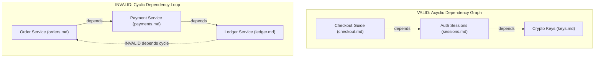

# ODS · Document Graph & Identity

This document specifies the **ODS Document Graph**: document identity, path-derived IDs, single source of truth rules, graph edge types (`depends` / `related`), DAG cycle prevention, and the principle of **Knowledge Graph Purity**.

## At a glance

- **What this chapter defines:** Path-derived IDs, `depends` vs `related`, acyclicity, and document-only purity.
- **Why it exists:** Tools can only lint and walk edges that are explicit and well-typed.
- **When you need it:** You are linking documents, debugging a cycle, or implementing graph validation.
- **When you can skip it:** Isolated documents with no prerequisites — you do not need a graph yet.
- **Learn this first:** [Link documents](../guides/03-link-documents.md)
- **Prerequisite chapters:** [keys.md](keys.md)

---

## 1. Conformance Language

The key words **MUST**, **MUST NOT**, **REQUIRED**, **SHALL**, **SHALL NOT**, **SHOULD**, **SHOULD NOT**, **RECOMMENDED**, **NOT RECOMMENDED**, **MAY**, and **OPTIONAL** in this document are to be interpreted as described in BCP 14, exactly as stated in [README.md §1](README.md#1-conformance-language). That is the canonical statement; do not maintain a second copy here.

---

## 2. Document Identity: IDs are Paths

Every ODS document has a unique identifier within its workspace.

### 2.1 Default: Path-Derived ID

By default, a document's ID **is its workspace-relative file path without the `.md` extension**, normalized using forward slash (`/`) separators:

```text
File Path on Disk                  Workspace Document ID
docs/guides/setup.md           →   docs/guides/setup
features/billing/checkout.md   →   features/billing/checkout
README.md                      →   README
```

- **Deterministic & Zero-Config**: Authors do not need to invent arbitrary UUIDs, database slugs, or hash strings.
- **Normalization**: IDs are case-insensitive. Tools MUST normalize paths to lowercase `a-z`, `0-9`, `-`, `_`, and `/`.
- **Cross-Platform Separators**: Path separators MUST always be normalized to `/` across macOS, Linux, and Windows.

### 2.2 Explicit Override: `id`

An explicit `id` field MAY be set in frontmatter to override the path-derived ID:

```yaml
---
id: architecture/auth-v2
profile: architecture
status: stable
---
```

- **When to Use**: Use `id` primarily for **rename stability** when reorganizing heavily referenced legacy documents without immediately cascading link rewrites.
- **Uniqueness**: All document IDs (path-derived or explicit) MUST be unique across the workspace. Duplicate IDs MUST trigger a validation error (`GRAPH-001`).

---

## 3. The Document Graph

ODS models relationships between Markdown documents as a simple **document graph** with two edge types:

```text
┌─────────────────────────────────────────────────────────────────────────┐
│                         ODS DOCUMENT GRAPH                              │
│                                                                         │
│   depends (hard prerequisites)     related (soft discovery links)       │
│   ─────────────────────────────    ────────────────────────────────     │
│   • Strict DAG                     • Cycles allowed                     │
│   • Auto-traversed in context      • Not auto-traversed                 │
│   • Markdown paths only            • Markdown paths (2.0 baseline)      │
│                                    • + typed predicates (2.1, optional) │
└─────────────────────────────────────────────────────────────────────────┘
```

In ODS 2.0, both `depends` and `related` are **flat string arrays** of workspace-relative Markdown document paths. ODS **2.1** optionally extends `related` with Pareto predicate shorthand (see §4.4). `depends` remains string paths only in all versions. Entity handles and `@` symbolic resolution are not supported.

---

## 4. Structural Edge Types (`depends` & `related`)

### 4.1 `depends`: Hard Prerequisites (Strict DAG)

`depends` declares **hard structural and conceptual prerequisites** between Markdown documents. These edges:

- Form a **strict Directed Acyclic Graph (DAG)** — cycles are forbidden.
- Are **auto-traversed** during AI context resolution up to the workspace `context.default_max_depth` (default: 2 hops).
- MUST contain **Markdown document paths only** (e.g. `../auth/sessions.md`, `guides/setup.md`).

```yaml
---
description: Checkout flow integration guide.
profile: guide
status: stable
depends:
  - ../auth/sessions.md
  - ../crypto/jwt-spec.md
---
```

Each entry MUST be a non-empty string referencing a Markdown document path relative to the declaring document's directory, or an absolute workspace-relative path from the repository root. Tools resolve paths to document IDs and verify the target exists (`GRAPH-002`).

### 4.2 `related`: Soft Discovery Links

`related` declares **associative lateral reading links** between Markdown documents. These edges:

- Are **not auto-traversed** during context resolution (discovery graph only).
- **MAY form cycles** — mutual `related` references between two documents are valid.
- In ODS 2.0, each entry MUST be a Markdown document path string. In ODS 2.1, predicate shorthand and custom verbs are also permitted (§4.4). All targets use the same path resolution rules as `depends`.

```yaml
---
description: Refund policy overview.
profile: policy
status: stable
related:
  - ../guides/refunds.md
  - ../decisions/003-stripe-integration.md
  - ../faq/billing-faq.md
---
```

Use `related` for "see also" style references and **domain semantics** (ODS 2.1). Use `depends` when a reader or agent **must** understand the target document before the current one makes sense.

### 4.4 Pareto Ontology Predicates on `related` (ODS 2.1)

When the workspace declares `spec = "2.1"` (or loads `@ods/pack-pareto-ontology`), `related` accepts **three entry forms**:

1. **Plain path** (same as ODS 2.0): `- guides/refunds.md`
2. **Predicate shorthand** (one predicate key per list item): `- governed_by: policies/refund-policy.md`
3. **Custom verb** (escape hatch): `- predicate: custom` / `verb:` / `target:`

#### The 5 Pareto predicates (closed vocabulary)

| Predicate | Meaning | Example target |
| :--- | :--- | :--- |
| `is_a` | Subtype / specialization | `concepts/party.md` |
| `part_of` | Composition | `concepts/billing-account.md` |
| `owns` | Lifecycle ownership | `concepts/subscription.md` |
| `governed_by` | Policy / rule document | `policies/refund-policy.md` |
| `maps_to` | API, table, or physical binding | `api/customer-api.md` |

```yaml
related:
  - ../guides/refunds.md
  - governed_by: ../policies/refund-policy.md
  - maps_to: ../api/refunds-api.md
```

Unknown predicate keys in shorthand are rejected (`ENUM-006`). Targets MUST be workspace-relative Markdown paths — not `@Entity` handles.

Entity identity keys (`entity`, `domain`, `schema`) are defined in [keys.md §7.10–7.12](keys.md#710-entity-ods-21). Full workflow: [guides/09-domain-ontology.md](../guides/09-domain-ontology.md).

### 4.5 Choosing Between `depends` and `related`

| Situation | Use |
| :--- | :--- |
| Reader must understand target before current doc | `depends` |
| Optional background reading | `related` |
| Target is a JSON schema, CSV, or binary file | `load` (not a graph edge) |
| Two docs are mutually informative | `related` on both (cycles OK) |
| Doc A requires Doc B, and B requires A | **Invalid** — refactor or demote one edge to `related` |

---

## 5. Knowledge Graph Purity (Normative)

A critical principle of ODS is **Knowledge Graph Purity**:

```text
┌─────────────────────────────────────────────────────────────────────────┐
│ PRINCIPLE: KNOWLEDGE GRAPH PURITY                                       │
│ • 'depends' expresses conceptual prerequisites between DOCUMENTS.       │
│ • Non-document fixtures (JSON schemas, sample CSVs, mock payloads) MUST │
│   NOT be placed in 'depends' or 'related'.                              │
│ • Why? Non-document files cannot participate in topological sort DAG    │
│   validation. Auxiliary test/prompt data belongs in 'load'.             │
└─────────────────────────────────────────────────────────────────────────┘
```

```yaml
# VALID: Pure knowledge graph + surgical prompt scoping
---
description: Authentication session guide.
profile: guide
status: stable
depends:
  - ../auth/sessions.md
  - ../crypto/jwt-spec.md
load:
  - ../schemas/auth-payload.json
---

# INVALID: Corrupting the knowledge graph with non-document fixtures
---
depends:
  - ../auth/sessions.md
  - ../schemas/auth-payload.json    # INVALID: JSON schema is not an ODS document!
---
```

---

## 6. DAG Validation & Cycle Prevention

The dependency graph formed by `depends` edges MUST be a **Directed Acyclic Graph (DAG)**.



### 6.1 Cycle Detection Algorithm

1. Tooling performs a topological sort or Depth-First Search (DFS) traversal of all `depends` edges across the workspace.
2. If any node path encounters a back-edge to an ancestor node in the active traversal stack, a cycle error is reported (`GRAPH-004`).
3. If two documents are mutually interdependent, one relationship MUST be changed to `related` or refactored into a shared prerequisite document.

---

## 7. Single Source of Truth & Dynamic Backlinks

1. **Title Single Source of Truth**: In ODS 2.0, the document title exists as the first `# H1` in the prose body. If `title:` or `name:` is present in frontmatter, it MUST match that heading (`TITLE-001`). See [core.md §3.1](core.md#31-frontmatter).
2. **Relationships Live in Frontmatter**: Machine-readable dependencies live exclusively in `depends` and `related`.
3. **No Hand-Written Backlinks**: Authors MUST declare graph edges only on the dependent document. Inbound backlinks MUST be computed dynamically by tooling (`ods graph --backlinks`) and NEVER hand-maintained in frontmatter.

---

## 8. Design Decisions

### Why optional typed `related` in 2.1?

ODS 2.0 uses string-only `related` for maximum simplicity. ODS 2.1 adds an **optional** Pareto layer: five predicates cover most domain linking without re-importing 1.1's large vocabulary, `@` handles, or edge metadata. Documents without typed `related` remain fully valid.

### Why forbid hand-written backlinks?

Maintaining bidirectional links manually (e.g. Doc A listing Doc B as child, and Doc B listing Doc A as parent) results in link rot whenever a file is renamed or moved. Computing backlinks on demand in tooling ensures synchronization accuracy.

### Why path-derived IDs?

Path-derived IDs require zero configuration, survive Git history, and align with how developers already navigate repositories. Explicit `id` overrides exist only for rename stability during migrations.

---

## Navigation & Reading Order

| [← Previous Chapter](profiles.md) | [📑 Specification Index](README.md) | [Next Chapter →](context.md) |
| :--- | :---: | ---: |
| **04. Structural Profiles & Shapes** | **Open Document Spec (ODS)** | **06. Bounded AI Context Scope** |
