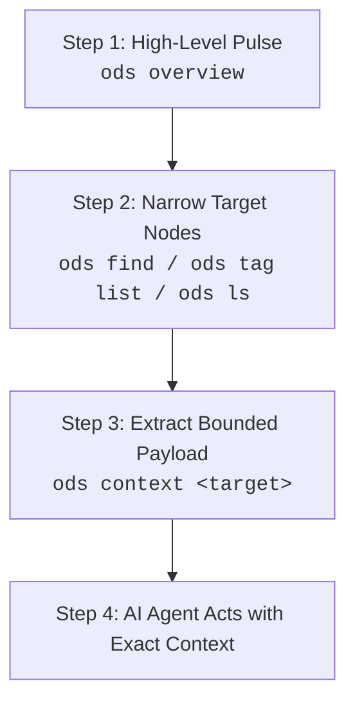

# ODS · Workspace Configuration & Progressive Discovery

This document specifies the **ODS Workspace Configuration** (`ods.toml`), the elimination of committed folder index files, and the **Progressive Discovery** model for human developers and AI agents.

## At a glance

- **What this chapter defines:** Root `ods.toml`, ignore defaults, and discovery commands (`overview` → `find` / `ls` / `tree` → `context`).
- **Why it exists:** A workspace needs one boundary file, not committed folder indexes that churn in Git.
- **When you need it:** You are configuring a repo, adding ignore rules, or implementing discovery.
- **When you can skip it:** `spec = "0.1"` is already enough to start — see [Your first document](../guides/01-first-document.md).
- **Learn this first:** [Run the workspace](../guides/06-run-the-workspace.md)
- **Prerequisite chapters:** [keys.md](keys.md)

---

## 1. Conformance Language

The key words **MUST**, **MUST NOT**, **REQUIRED**, **SHALL**, **SHALL NOT**, **SHOULD**, **SHOULD NOT**, **RECOMMENDED**, **NOT RECOMMENDED**, **MAY**, and **OPTIONAL** in this document are to be interpreted as described in BCP 14 ([RFC 2119](https://www.rfc-editor.org/rfc/rfc2119.txt), [RFC 8174](https://www.rfc-editor.org/rfc/rfc8174.txt)) when, and only when, they appear in all capitals.

---

## 2. Workspace Marker: `ods.toml`

An ODS workspace is declared by the presence of a single **`ods.toml`** file at the repository root:

```toml
# ═════════════════════════════════════════════════════════════════
# ods.toml — Repository root configuration (Workspace Boundary)
# ═════════════════════════════════════════════════════════════════

# Targeted ODS specification version (Required workspace marker)
spec = "0.1"

# Directory path prefixes excluded from document scanning and linting
ignore = [
  "src",
  "target",
  "node_modules",
  "dist",
  "vendor"
]

# Relative file paths to custom profile definitions
custom_profiles = [
  "docs/profiles/rfc.md",
  "docs/profiles/experiment.md"
]

# Imported reusable ODS pack directories or remote pack roots
packs = [
  "vendor/engineering-pack"
]

# Workspace-wide section heading synonyms for profile validation
[aliases]
Goal = ["Objective", "Purpose", "Target"]
Validation = ["Sanity Checks", "Smoke Tests", "Verification"]

# Multi-spec dialect activation
[specs.okf]
enabled = false                               # Google OKF knowledge verification checks

[specs.skills]
enabled = false                               # Agent Skills (SKILL.md) package checks

# Background watcher & memory budget settings
[service]
mode = "poll"                                 # Background watcher mode: "poll" or "notify"
poll_secs = 2                                 # Polling interval in seconds
max_rss_mb = 10                               # Soft memory (RSS) budget for daemon
```

---

## 3. Progressive Discovery CLI Workflow

Rather than reading massive index files, human developers and AI agents navigate an ODS workspace through **Progressive Discovery** commands:



### 1. High-Level Workspace Pulse (`ods overview`)
Returns workspace health, total document count, profile breakdown, and validation status:
```bash
$ ods overview
Workspace: /Users/dev/projects/billing-service (ODS v0.1)
Documents: 48 (Compliant: 48, Non-compliant: 0)
Profiles:  18 guides, 12 features, 8 decisions, 10 notes
Tags:      auth (8), billing (14), database (6), api (11)
Daemon:    active (RSS: 6.4 MB / Budget: 10 MB)
```

### 2. Targeted Querying & Filtering
Locate relevant files without reading file bodies:
```bash
# Find documents by frontmatter key value
$ ods find --key status=draft
docs/guides/new-auth.md
docs/features/subscriptions.md

# List all documents carrying a specific tag
$ ods find --tag billing
docs/features/checkout.md
docs/guides/refunds.md
docs/decisions/003-stripe-integration.md

# List direct directory children
$ ods ls docs/guides
docs/guides/setup.md
docs/guides/refunds.md
docs/guides/troubleshooting.md

# Inspect directory hierarchy
$ ods tree docs/features --depth 2
docs/features/
├── billing/
│   ├── checkout.md
│   └── refunds.md
└── auth/
    ├── login.md
    └── sessions.md
```

### 3. Bounded Context Extraction (`ods context`)
Assembles the precise bounded context for the task:
```bash
$ ods context docs/features/billing/refunds.md --max-tokens 3000
--- Context Bundle (2,450 tokens) ---
[1/4] docs/crypto/tokens.md (Prerequisite @ Depth 2)
[2/4] docs/auth/sessions.md (Prerequisite @ Depth 1)
[3/4] schemas/refund-payload.json (Auxiliary via context.load)
[4/4] docs/features/billing/refunds.md (Entrypoint document)
--- End Context Bundle ---
```

---

## 4. Incremental Engine & Memory Budget

Conformant ODS implementations:
1. **Incremental Reparsing**: When a file is modified, the engine MUST reparse only the changed frontmatter rather than re-indexing the entire workspace.
2. **Strict Resource Budget**: The background service daemon SHOULD operate within a **`10 MB RSS`** soft memory budget (`service.max_rss_mb = 10`), making it suitable for continuous execution in resource-constrained container and CI environments.

---

## 5. Scan Ignore Defaults

Tools MUST automatically exclude the following directories and file patterns from indexing, even if not explicitly listed in `ods.toml` `ignore`:

```text
.git/          .hg/          .svn/         .jj/
node_modules/  target/       dist/         build/
.artifacts/    __pycache__/  .venv/        venv/
vendor/        .* (hidden files and folders)
```

---

## 6. Design Decisions

### Why `ods.toml` instead of a YAML configuration file?
TOML provides unambiguous typing for configuration tables and array structures, preventing syntax ambiguity between document YAML frontmatter and repository-level configuration.

### Why progressive discovery over static sitemaps?
Progressive discovery scales effortlessly to monorepos containing tens of thousands of documents. AI agents can start with a 100-token overview and drill down to a 2,000-token context payload without ever loading unnecessary directory trees.

---

## Navigation & Reading Order

| [← Previous Chapter](assets.md) | [📑 Specification Index](README.md) | [Next Chapter →](validation.md) |
| :--- | :---: | ---: |
| **07. Assets & Code Bindings** | **Open Document Spec (ODS)** | **09. Validation & Tooling Contract** |
