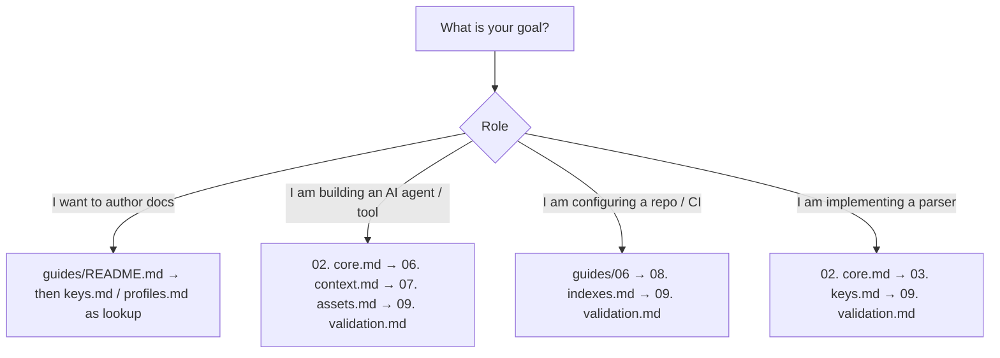

# ODS · Specification Map (Reference)

**Open Document Spec (ODS)** is an open, Markdown-first specification for structuring, linking, and validating documentation and knowledge in Git repositories so both **human developers** and **AI agents** can navigate, query, and maintain it deterministically.

This file is the **reference map** for the normative chapters. It is not the tutorial.

- **Learning ODS** (why / what / when / where / how, novice → expert): [`guides/README.md`](../guides/README.md)
- **Formal terms**: [`glossary.md`](glossary.md)

## At a glance

- **What this chapter defines:** How the specification modules fit together, who should read which chapter, and the conformance words used in normative text.
- **Why it exists:** Implementers and reviewers need one map. Authors need a different door.
- **When you need it:** You are looking up a chapter, citing the spec, or building a tool.
- **When you can skip it:** You are learning to write documents — start at [Learn ODS](../guides/README.md).
- **Learn this first:** [Why ODS exists](../guides/00-why-ods.md)
- **Prerequisite chapters:** None.

---

## 1. Conformance Language

In the normative sections of the ODS specification modules, the key words **MUST**, **MUST NOT**, **REQUIRED**, **SHALL**, **SHALL NOT**, **SHOULD**, **SHOULD NOT**, **RECOMMENDED**, **NOT RECOMMENDED**, **MAY**, and **OPTIONAL** are to be interpreted as described in BCP 14 ([RFC 2119](https://www.rfc-editor.org/rfc/rfc2119.txt), [RFC 8174](https://www.rfc-editor.org/rfc/rfc8174.txt)) when, and only when, they appear in all capitals.

Non-normative material—including design rationales, overview sections, and author cheat sheets—is explicitly identified where present.

---

## 2. The 5W1H of ODS (summary)

Taught in full in [Why ODS exists](../guides/00-why-ods.md). Short form for implementers:

| Question | Answer |
| :--- | :--- |
| **WHAT** | A convention for plain `.md` files: optional YAML frontmatter (universal keys + an `ods:` engine namespace) and a root `ods.toml` workspace marker. |
| **WHY** | Unstructured Markdown drifts, links rot, and AI tools waste tokens or hallucinate context. ODS makes identity, relationships, bindings, and reading lists lintable. |
| **WHEN** | Architecture docs, runbooks, ADRs, PRDs, onboarding guides, or agent knowledge in Git. |
| **WHERE** | Inside the repository, alongside code. Coexists with Hugo, Astro, Docusaurus, Next.js, and Obsidian. |
| **HOW** | Humans write Markdown. Tools lint the graph and assemble bounded context on demand. |

---

## 3. Terms needed to read this map

Full dictionary: [`glossary.md`](glossary.md). Only these are required to navigate the chapters:

| Term | Meaning | Defined in |
| :--- | :--- | :--- |
| **Workspace** | Directory tree whose root `ods.toml` declares `spec`. | [indexes.md](indexes.md) |
| **Document** | Any `.md` file in the workspace. Frontmatter is optional. | [core.md](core.md) |
| **Frontmatter** | Optional YAML between `---` lines at the top of a document. | [core.md](core.md) |
| **Profile** | Document *shape* (expected H2/H3 headings), not a file type. | [profiles.md](profiles.md) |

---

## 4. Specification Module Map (10 Chapters + Glossary)

The specification is structured into 10 focused modules and a terminology reference. **Authors should not read 01–10 linearly** — use [Learn ODS](../guides/README.md). Implementers may walk 02 → 03 → 09 (`core` → `keys` → `validation`) first.

```
guides/              # Human learning track (start at guides/README.md)
specs/
├── README.md        # Chapter 01 · Specification map (you are here) — not the tutorial
├── core.md          # Chapter 02 · Format Model, Binary Compliance & Lifecycle Operations
├── keys.md          # Chapter 03 · Frontmatter Key Dictionary & 3-Tier Placement Rules
├── profiles.md      # Chapter 04 · Structural Profiles, Expected Headings & Packs
├── graph.md         # Chapter 05 · Document Graph, Path-Derived IDs & DAG Edges
├── context.md       # Chapter 06 · Deterministic Bounded AI Context & Token Optimization
├── assets.md        # Chapter 07 · Non-Markdown Resources & Source Code Bindings
├── indexes.md       # Chapter 08 · Workspace Config (ods.toml) & Progressive Discovery
├── validation.md    # Chapter 09 · Normative Lint Rules, Diagnostics & Tooling Contract
├── scope.md         # Chapter 10 · Boundaries, Non-Goals & Architectural Trade-offs
└── glossary.md      # Reference · Exhaustive Normative Terminology Dictionary & Disambiguation
```

---

## 5. Canonical End-to-End Reading Sequence

Implementer and reviewer order (not the human learning path):

| Chapter | Specification Module | Focus Area & Key Takeaway |
| :---: | :--- | :--- |
| **01** | [**`README.md`**](README.md) *(Current)* | **Overview & Terminology**: 5W1H principles and specification map. |
| **02** | [**`core.md`**](core.md) | **Format Model**: Frontmatter vs body prose, SSOT, 4 lifecycle operations (`new`, `mv`, `archive`, `rm`). |
| **03** | [**`keys.md`**](keys.md) | **Key Dictionary**: Top-level vs `ods:` block keys, data types, and copy-paste examples. |
| **04** | [**`profiles.md`**](profiles.md) | **Profiles & Shapes**: 13 standard profiles (`guide`, `decision`, `feature`, etc.), heading contracts, custom profiles. |
| **05** | [**`graph.md`**](graph.md) | **Graph & Identity**: Path-derived document IDs, `depends` (DAG) vs `related`, cycle prevention. |
| **06** | [**`context.md`**](context.md) | **AI Context Scope**: Bounded context loading algorithm, `load`/`ignore`/`max-depth`, token cost reduction. |
| **07** | [**`assets.md`**](assets.md) | **Assets & Code**: Attached `resources` and 8 source `code` roles (`entrypoint`, `implementation`, `test`, etc.). |
| **08** | [**`indexes.md`**](indexes.md) | **Workspace & Discovery**: Root `ods.toml`, elimination of folder indexes, progressive CLI workflow. |
| **09** | [**`validation.md`**](validation.md) | **Validation Contract**: Binary compliance (exit code 0 vs 1), lint severity matrix, unknown key preservation. |
| **10** | [**`scope.md`**](scope.md) | **Scope & Non-Goals**: Deliberate architectural boundaries, out-of-scope features, and design trade-offs. |
| **REF**| [**`glossary.md`**](glossary.md) | **Normative Glossary**: Comprehensive definitions across 7 domains and concept disambiguation. |

---

## 6. Role-Based Fast-Track Pathways

If you are reading for a specific implementation goal, choose your accelerated pathway:



| Goal | Sequence |
| :--- | :--- |
| **Author documents** | [Learn ODS](../guides/README.md), then look up [keys.md](keys.md) / [profiles.md](profiles.md) |
| **Formal format model** | [02. core.md](core.md) → [03. keys.md](keys.md) → [09. validation.md](validation.md) |
| **AI context & token budgets** | [guides/05](../guides/05-ai-reading-list.md), then [06. context.md](context.md) |
| **Workspace & CI gates** | [guides/06](../guides/06-run-the-workspace.md), then [08. indexes.md](indexes.md) → [09. validation.md](validation.md) |
| **Code bindings** | [guides/04](../guides/04-bind-code-and-files.md), then [07. assets.md](assets.md) |
| **Architectural boundaries** | [10. scope.md](scope.md) |

---

## 7. Design Principles

Canonical, normative list: [core.md §2](core.md#2-design-principles-priority-order). Do not maintain a second copy here.

---

## 8. Multi-Dialect Context

The `ods` engine operates on the native ODS dialect by default. Sibling dialects are activated via explicit command-line flags:
- **ODS (Default)**: Engineering docs, graph relationships, code bindings, bounded AI context.
- **`--okf` (Google OKF v0.2)**: Knowledge bundles emphasizing provenance, verification dates, and trust tiers.
- **`--skills` (Agent Skills)**: Packaging reusable agent skill definitions (`SKILL.md`).

---

## Navigation & Reading Order

| Chapter 01 (Current) | [📑 Specification Index](README.md) | [Next Chapter →](core.md) |
| :--- | :---: | ---: |
| **01. Introduction & Overview** | **Open Document Spec (ODS)** | **02. Core Format Model & Conformance** |
